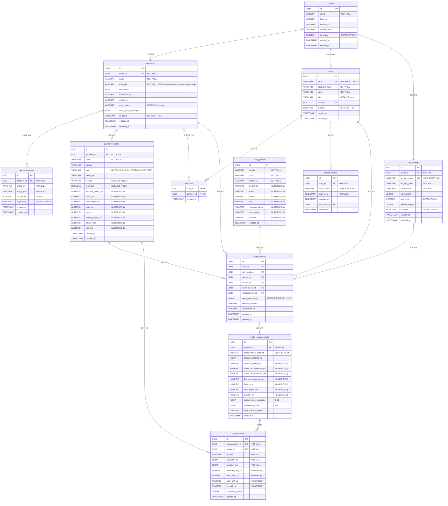

# 데이터베이스 스키마 설계 (ERD)

> AutoFit v2 WebAR — PostgreSQL 16 데이터베이스 스키마

## 1. 엔티티 관계 개요

```
brands ──< garments ──< garment_images
               │
               ├──< garment_variants ──< fit_evaluations
               │
users ──< favorites >── garments

users ──< fitting_sessions >── garment_variants
               │
               ├── body_presets (참조)
               │
                └──< body_measurements ──< fit_evaluations

users ──< refresh_tokens

brands ──< sdk_configs ──< fitting_sessions (선택)
```

- `brands`는 여러 `garments`를 가진다 (1:N) — 업체/브랜드가 상품을 등록하는 주체
- `garments`는 여러 `garment_images`를 가진다 (1:N) — 상품 다각도 이미지
- `garments`는 여러 `garment_variants`를 가진다 (1:N)
- `users`는 여러 `favorites`를 가진다 (1:N) — 사용자 즐겨찾기(의류)
- `users`는 여러 `fitting_sessions`를 가진다 (1:N)
- `fitting_sessions`는 하나의 `garments`, `garment_variants`, `body_presets`를 참조한다
- `body_presets`는 독립 엔티티 (성별+사이즈 조합)
- `body_measurements`는 `fitting_sessions`에 속한다 (1:N)
- `fit_evaluations`는 `body_measurements`와 `garment_variants`를 참조한다
- `users`는 여러 `refresh_tokens`를 가진다 (1:N) — Refresh Token 회전/폐기 관리
- `sdk_configs`는 `brands`에 속한다 (1:N) — 외부 쇼핑몰/임베드 SDK 클라이언트별 설정

---

## 2. 테이블 정의

### users — 사용자

| 컬럼 | 타입 | 제약조건 | 설명 |
|------|------|----------|------|
| id | UUID | PK, DEFAULT gen_random_uuid() | 사용자 고유 ID |
| email | VARCHAR(255) | UNIQUE, NOT NULL | 로그인 이메일 |
| password_hash | VARCHAR(255) | NOT NULL | bcrypt 해시된 비밀번호 |
| name | VARCHAR(100) | NOT NULL | 사용자 이름 |
| role | VARCHAR(20) | DEFAULT 'user', CHECK(role IN ('user', 'vendor', 'manager', 'admin')) | 권한 역할 |
| brand_id | UUID | FK → brands(id) ON DELETE SET NULL | 소속 브랜드 ID (vendor만 사용) |
| is_active | BOOLEAN | DEFAULT TRUE, NOT NULL | 계정 활성화 여부 |
| created_at | TIMESTAMP WITH TIME ZONE | DEFAULT NOW() | 생성 일시 |
| updated_at | TIMESTAMP WITH TIME ZONE | DEFAULT NOW() | 수정 일시 |

```sql
CREATE TABLE users (
    id UUID PRIMARY KEY DEFAULT gen_random_uuid(),
    email VARCHAR(255) UNIQUE NOT NULL,
    password_hash VARCHAR(255) NOT NULL,
    name VARCHAR(100) NOT NULL,
    role VARCHAR(20) DEFAULT 'user' CHECK (role IN ('user', 'vendor', 'manager', 'admin')),
    brand_id UUID REFERENCES brands(id) ON DELETE SET NULL,
    is_active BOOLEAN NOT NULL DEFAULT TRUE,
    created_at TIMESTAMP WITH TIME ZONE DEFAULT NOW(),
    updated_at TIMESTAMP WITH TIME ZONE DEFAULT NOW(),
    CONSTRAINT email_format CHECK (
        email ~* '^[A-Za-z0-9._%+-]+@[A-Za-z0-9.-]+\.[A-Za-z]{2,}$'
    ),
    CONSTRAINT chk_users_vendor_brand CHECK (
        (role <> 'vendor' AND brand_id IS NULL) OR (role = 'vendor' AND brand_id IS NOT NULL)
    )
);
```

---

### refresh_tokens — Refresh Token (회전/폐기)

| 컬럼 | 타입 | 제약조건 | 설명 |
|------|------|----------|------|
| id | UUID | PK, DEFAULT gen_random_uuid() | 토큰 고유 ID |
| user_id | UUID | FK → users(id) ON DELETE CASCADE, NOT NULL | 사용자 ID |
| token_hash | VARCHAR(255) | UNIQUE, NOT NULL | Refresh Token 해시 (원문 미저장) |
| expires_at | TIMESTAMP WITH TIME ZONE | NOT NULL | 만료 일시 |
| revoked_at | TIMESTAMP WITH TIME ZONE | - | 폐기 일시 (로그아웃/재사용 탐지) |
| replaced_by | UUID | FK → refresh_tokens(id) ON DELETE SET NULL | 회전(rotate)으로 교체된 다음 토큰 ID |
| created_at | TIMESTAMP WITH TIME ZONE | DEFAULT NOW() | 생성 일시 |

> Refresh Token은 **원문을 DB에 저장하지 않고** 단방향 해시(`token_hash`)만 저장한다.
> 재사용 탐지 및 즉시 로그아웃(폐기)을 위해 서버 저장소가 필요하다.

```sql
CREATE TABLE refresh_tokens (
    id UUID PRIMARY KEY DEFAULT gen_random_uuid(),
    user_id UUID NOT NULL REFERENCES users(id) ON DELETE CASCADE,
    token_hash VARCHAR(255) UNIQUE NOT NULL,
    expires_at TIMESTAMP WITH TIME ZONE NOT NULL,
    revoked_at TIMESTAMP WITH TIME ZONE,
    replaced_by UUID REFERENCES refresh_tokens(id) ON DELETE SET NULL,
    created_at TIMESTAMP WITH TIME ZONE DEFAULT NOW()
);
```

---

### brands — 업체/브랜드

| 컬럼 | 타입 | 제약조건 | 설명 |
|------|------|----------|------|
| id | UUID | PK, DEFAULT gen_random_uuid() | 브랜드 고유 ID |
| name | VARCHAR(200) | NOT NULL | 브랜드/업체명 |
| logo_url | VARCHAR(500) | - | 로고 이미지 URL |
| website_url | VARCHAR(500) | - | 웹사이트 URL |
| contact_email | VARCHAR(255) | - | 담당자 이메일 |
| is_active | BOOLEAN | DEFAULT TRUE | 활성화 여부 |
| created_at | TIMESTAMP WITH TIME ZONE | DEFAULT NOW() | 생성 일시 |
| updated_at | TIMESTAMP WITH TIME ZONE | DEFAULT NOW() | 수정 일시 |

```sql
CREATE TABLE brands (
    id UUID PRIMARY KEY DEFAULT gen_random_uuid(),
    name VARCHAR(200) NOT NULL,
    logo_url VARCHAR(500),
    website_url VARCHAR(500),
    contact_email VARCHAR(255),
    is_active BOOLEAN DEFAULT TRUE,
    created_at TIMESTAMP WITH TIME ZONE DEFAULT NOW(),
    updated_at TIMESTAMP WITH TIME ZONE DEFAULT NOW()
);
```

---

### garments — 의류

| 컬럼 | 타입 | 제약조건 | 설명 |
|------|------|----------|------|
| id | UUID | PK, DEFAULT gen_random_uuid() | 의류 고유 ID |
| brand_id | UUID | FK → brands(id), NOT NULL | 소속 브랜드 ID |
| name | VARCHAR(200) | NOT NULL | 의류명 |
| category | VARCHAR(50) | NOT NULL, CHECK | 카테고리 (top/bottom/dress/outer/accessory) |
| description | TEXT | - | 의류 설명 |
| thumbnail_url | VARCHAR(500) | - | 썸네일 이미지 URL |
| model_url | VARCHAR(500) | - | 3D 모델 URL (glTF/GLB 경로, 에셋 생성 완료 후 설정) |
| asset_status | VARCHAR(20) | DEFAULT 'pending', CHECK | 3D 에셋 생성 상태 (pending/processing/ready/failed) |
| asset_error_message | TEXT | - | 3D 에셋 생성 실패 사유 (asset_status=failed) |
| is_active | BOOLEAN | DEFAULT TRUE | 활성화 여부 (소프트 삭제용) |
| created_at | TIMESTAMP WITH TIME ZONE | DEFAULT NOW() | 생성 일시 |
| updated_at | TIMESTAMP WITH TIME ZONE | DEFAULT NOW() | 수정 일시 |

`asset_status` 상태 설명:
- `pending`: 이미지만 업로드됨, 3D 미생성
- `processing`: Image-to-3D 생성 중
- `ready`: 3D 에셋 준비 완료
- `failed`: 생성 실패 (asset_error_message에 원인 저장)

```sql
CREATE TABLE garments (
    id UUID PRIMARY KEY DEFAULT gen_random_uuid(),
    brand_id UUID NOT NULL REFERENCES brands(id),
    name VARCHAR(200) NOT NULL,
    category VARCHAR(50) NOT NULL CHECK (
        category IN ('top', 'bottom', 'dress', 'outer', 'accessory')
    ),
    description TEXT,
    thumbnail_url VARCHAR(500),
    model_url VARCHAR(500),
    asset_status VARCHAR(20) DEFAULT 'pending' CHECK (
        asset_status IN ('pending', 'processing', 'ready', 'failed')
    ),
    asset_error_message TEXT,
    is_active BOOLEAN DEFAULT TRUE,
    created_at TIMESTAMP WITH TIME ZONE DEFAULT NOW(),
    updated_at TIMESTAMP WITH TIME ZONE DEFAULT NOW()
);
```

---

### favorites — 의류 즐겨찾기

사용자가 의류를 즐겨찾기하는 N:M 관계를 표현한다.

| 컬럼 | 타입 | 제약조건 | 설명 |
|------|------|----------|------|
| user_id | UUID | PK, FK → users(id) ON DELETE CASCADE | 사용자 ID |
| garment_id | UUID | PK, FK → garments(id) ON DELETE CASCADE | 의류 ID |
| created_at | TIMESTAMP WITH TIME ZONE | DEFAULT NOW() | 생성 일시 |

```sql
CREATE TABLE favorites (
    user_id UUID NOT NULL REFERENCES users(id) ON DELETE CASCADE,
    garment_id UUID NOT NULL REFERENCES garments(id) ON DELETE CASCADE,
    created_at TIMESTAMP WITH TIME ZONE DEFAULT NOW(),
    PRIMARY KEY (user_id, garment_id)
);
```

---

### garment_images — 상품 이미지 (다각도)

| 컬럼 | 타입 | 제약조건 | 설명 |
|------|------|----------|------|
| id | UUID | PK, DEFAULT gen_random_uuid() | 이미지 고유 ID |
| garment_id | UUID | FK → garments(id) ON DELETE CASCADE, NOT NULL | 소속 의류 ID |
| image_url | VARCHAR(500) | NOT NULL | 이미지 URL |
| image_type | VARCHAR(30) | NOT NULL, CHECK | 이미지 유형 (front/back/side_left/side_right/detail/multi_angle/flat_lay) |
| sort_order | INTEGER | DEFAULT 0 | 정렬 순서 |
| is_primary | BOOLEAN | DEFAULT FALSE | 대표 이미지 여부 |
| created_at | TIMESTAMP WITH TIME ZONE | DEFAULT NOW() | 생성 일시 |
| updated_at | TIMESTAMP WITH TIME ZONE | DEFAULT NOW() | 수정 일시 |

```sql
CREATE TABLE garment_images (
    id UUID PRIMARY KEY DEFAULT gen_random_uuid(),
    garment_id UUID NOT NULL REFERENCES garments(id) ON DELETE CASCADE,
    image_url VARCHAR(500) NOT NULL,
    image_type VARCHAR(30) NOT NULL CHECK (
        image_type IN ('front', 'back', 'side_left', 'side_right', 'detail', 'multi_angle', 'flat_lay')
    ),
    sort_order INTEGER DEFAULT 0,
    is_primary BOOLEAN DEFAULT FALSE,
    created_at TIMESTAMP WITH TIME ZONE DEFAULT NOW(),
    updated_at TIMESTAMP WITH TIME ZONE DEFAULT NOW()
);
```

---

### garment_variants — 의류 변형

| 컬럼 | 타입 | 제약조건 | 설명 |
|------|------|----------|------|
| id | UUID | PK, DEFAULT gen_random_uuid() | 변형 고유 ID |
| garment_id | UUID | FK → garments(id) ON DELETE CASCADE, NOT NULL | 소속 의류 ID |
| color | VARCHAR(50) | NOT NULL | 색상 |
| pattern | VARCHAR(50) | - | 패턴 (무지, 스트라이프 등) |
| size | VARCHAR(10) | NOT NULL, CHECK | 사이즈 (XS/S/M/L/XL/XXL/FREE) |
| model_url | VARCHAR(500) | - | 변형별 별도 3D 모델 URL |
| fit_type | VARCHAR(20) | DEFAULT 'regular', CHECK | 핏 타입 (slim/regular/oversize) |
| is_default | BOOLEAN | DEFAULT FALSE, NOT NULL | 기본 변형 여부 (variant_id 미지정 시 선택) |
| shoulder_width_cm | NUMERIC(5,1) | - | 어깨너비 (cm) |
| chest_cm | NUMERIC(5,1) | - | 가슴둘레 (cm) |
| total_length_cm | NUMERIC(5,1) | - | 총장 (cm) |
| waist_cm | NUMERIC(5,1) | - | 허리둘레 (cm) |
| hip_cm | NUMERIC(5,1) | - | 힙둘레 (cm) |
| sleeve_length_cm | NUMERIC(5,1) | - | 소매길이 (cm) |
| inseam_cm | NUMERIC(5,1) | - | 인심 (cm, 하의용) |
| rise_cm | NUMERIC(5,1) | - | 밑위 (cm, 하의용) |
| created_at | TIMESTAMP WITH TIME ZONE | DEFAULT NOW() | 생성 일시 |
| updated_at | TIMESTAMP WITH TIME ZONE | DEFAULT NOW() | 수정 일시 |

> 모든 치수 컬럼은 NULL 허용 — 카테고리별 필요 항목이 다르기 때문.

```sql
CREATE TABLE garment_variants (
    id UUID PRIMARY KEY DEFAULT gen_random_uuid(),
    garment_id UUID NOT NULL REFERENCES garments(id) ON DELETE CASCADE,
    color VARCHAR(50) NOT NULL,
    pattern VARCHAR(50),
    size VARCHAR(10) NOT NULL CHECK (size IN ('XS', 'S', 'M', 'L', 'XL', 'XXL', 'FREE')),
    model_url VARCHAR(500),
    fit_type VARCHAR(20) DEFAULT 'regular' CHECK (fit_type IN ('slim', 'regular', 'oversize')),
    is_default BOOLEAN NOT NULL DEFAULT FALSE,
    shoulder_width_cm NUMERIC(5,1),
    chest_cm NUMERIC(5,1),
    total_length_cm NUMERIC(5,1),
    waist_cm NUMERIC(5,1),
    hip_cm NUMERIC(5,1),
    sleeve_length_cm NUMERIC(5,1),
    inseam_cm NUMERIC(5,1),
    rise_cm NUMERIC(5,1),
    created_at TIMESTAMP WITH TIME ZONE DEFAULT NOW(),
    updated_at TIMESTAMP WITH TIME ZONE DEFAULT NOW(),
    CONSTRAINT uq_variant UNIQUE (garment_id, color, size, fit_type)
);
```

---

### body_presets — 바디 프리셋

| 컬럼 | 타입 | 제약조건 | 설명 |
|------|------|----------|------|
| id | UUID | PK, DEFAULT gen_random_uuid() | 프리셋 고유 ID |
| gender | VARCHAR(10) | NOT NULL, CHECK | 성별 (male/female) |
| size | VARCHAR(10) | NOT NULL, CHECK | 사이즈 (S/M/L/XL) |
| model_url | VARCHAR(500) | NOT NULL | 3D 바디 모델 URL |
| height_cm | NUMERIC(5,1) | - | 키 (cm) |
| chest | NUMERIC(5,1) | - | 가슴둘레 (cm) |
| waist | NUMERIC(5,1) | - | 허리 둘레 (cm) |
| hip | NUMERIC(5,1) | - | 엉덩이 둘레 (cm) |
| shoulder_width | NUMERIC(5,1) | - | 어깨 너비 (cm) |
| arm_length | NUMERIC(5,1) | - | 팔길이 (cm) |
| inseam | NUMERIC(5,1) | - | 다리안쪽 길이 (cm) |
| created_at | TIMESTAMP WITH TIME ZONE | DEFAULT CURRENT_TIMESTAMP | 생성 일시 |

```sql
CREATE TABLE body_presets (
    id UUID PRIMARY KEY DEFAULT gen_random_uuid(),
    gender VARCHAR(10) NOT NULL CHECK (gender IN ('male', 'female')),
    size VARCHAR(10) NOT NULL CHECK (size IN ('S', 'M', 'L', 'XL')),
    model_url VARCHAR(500) NOT NULL,
    height_cm NUMERIC(5,1),
    chest NUMERIC(5,1),
    waist NUMERIC(5,1),
    hip NUMERIC(5,1),
    shoulder_width NUMERIC(5,1),
    arm_length NUMERIC(5,1),
    inseam NUMERIC(5,1),
    created_at TIMESTAMP WITH TIME ZONE DEFAULT CURRENT_TIMESTAMP,
    CONSTRAINT uq_body_preset UNIQUE (gender, size)
);
```

---

### fitting_sessions — 피팅 세션

| 컬럼 | 타입 | 제약조건 | 설명 |
|------|------|----------|------|
| id | UUID | PK, DEFAULT gen_random_uuid() | 세션 고유 ID |
| user_id | UUID | FK → users(id) ON DELETE SET NULL | 사용자 ID |
| sdk_config_id | UUID | FK → sdk_configs(id) ON DELETE SET NULL | SDK 설정 ID (SDK 경유 세션인 경우) |
| garment_id | UUID | FK → garments(id) ON DELETE SET NULL | 피팅한 의류 ID |
| variant_id | UUID | FK → garment_variants(id) ON DELETE SET NULL | 선택한 변형 ID |
| body_preset_id | UUID | FK → body_presets(id) ON DELETE SET NULL | 바디 프리셋 ID |
| measurement_id | UUID | FK → body_measurements(id) ON DELETE SET NULL | 신체 측정 ID |
| depth_distance_m | FLOAT | - | 카메라-사용자 간 거리 (m, body_measurements.camera_distance_m과 동일 의미, 세션 레벨 스냅샷) |
| duration_seconds | INTEGER | - | 피팅 소요 시간 (초) |
| screenshot_url | VARCHAR(500) | - | 스크린샷 URL |
| created_at | TIMESTAMP WITH TIME ZONE | DEFAULT NOW() | 세션 생성 일시 |
| updated_at | TIMESTAMP WITH TIME ZONE | DEFAULT NOW() | 수정 일시 |

```sql
CREATE TABLE fitting_sessions (
    id UUID PRIMARY KEY DEFAULT gen_random_uuid(),
    user_id UUID REFERENCES users(id) ON DELETE SET NULL,
    sdk_config_id UUID REFERENCES sdk_configs(id) ON DELETE SET NULL,
    garment_id UUID REFERENCES garments(id) ON DELETE SET NULL,
    variant_id UUID REFERENCES garment_variants(id) ON DELETE SET NULL,
    body_preset_id UUID REFERENCES body_presets(id) ON DELETE SET NULL,
    measurement_id UUID REFERENCES body_measurements(id) ON DELETE SET NULL,
    depth_distance_m FLOAT,
    duration_seconds INTEGER CHECK (duration_seconds IS NULL OR duration_seconds >= 0),
    screenshot_url VARCHAR(500),
    created_at TIMESTAMP WITH TIME ZONE DEFAULT NOW(),
    updated_at TIMESTAMP WITH TIME ZONE DEFAULT NOW()
);
```

---

### body_measurements — 신체 측정

| 컬럼 | 타입 | 제약조건 | 설명 |
|------|------|----------|------|
| id | UUID | PK, DEFAULT gen_random_uuid() | 측정 고유 ID |
| session_id | UUID | FK → fitting_sessions(id) ON DELETE CASCADE, NOT NULL | 피팅 세션 ID |
| measurement_method | VARCHAR(20) | DEFAULT 'depth', CHECK | 측정 방식 (depth/pose_scale/user_input) |
| camera_distance_m | FLOAT | - | 카메라-사용자 거리 (m, depth 사용 시) |
| shoulder_width_cm | NUMERIC(5,1) | - | 어깨너비 (cm) |
| chest_circumference_cm | NUMERIC(5,1) | - | 가슴둘레 (cm) |
| waist_circumference_cm | NUMERIC(5,1) | - | 허리둘레 (cm) |
| hip_circumference_cm | NUMERIC(5,1) | - | 힙둘레 (cm) |
| height_cm | NUMERIC(5,1) | - | 키 (cm) |
| arm_length_cm | NUMERIC(5,1) | - | 팔길이 (cm) |
| inseam_cm | NUMERIC(5,1) | - | 인심 (cm) |
| measurement_accuracy | FLOAT | CHECK (measurement_accuracy >= 0 AND measurement_accuracy <= 99) | 측정 정확도 (%, 상한 99) |
| confidence_score | FLOAT | CHECK (confidence_score >= 0 AND confidence_score <= 1) | 신뢰도 점수 (0~1) |
| depth_model_version | VARCHAR(50) | DEFAULT 'v2-metric-small' | Depth 모델 버전 |
| created_at | TIMESTAMP WITH TIME ZONE | DEFAULT NOW() | 생성 일시 |

```sql
CREATE TABLE body_measurements (
    id UUID PRIMARY KEY DEFAULT gen_random_uuid(),
    session_id UUID NOT NULL REFERENCES fitting_sessions(id) ON DELETE CASCADE,
    measurement_method VARCHAR(20) DEFAULT 'depth' CHECK (
        measurement_method IN ('depth', 'pose_scale', 'user_input')
    ),
    camera_distance_m FLOAT CHECK (camera_distance_m IS NULL OR camera_distance_m > 0),
    shoulder_width_cm NUMERIC(5,1),
    chest_circumference_cm NUMERIC(5,1),
    waist_circumference_cm NUMERIC(5,1),
    hip_circumference_cm NUMERIC(5,1),
    height_cm NUMERIC(5,1),
    arm_length_cm NUMERIC(5,1),
    inseam_cm NUMERIC(5,1),
    measurement_accuracy FLOAT CHECK (measurement_accuracy >= 0 AND measurement_accuracy <= 99),
    confidence_score FLOAT CHECK (confidence_score >= 0 AND confidence_score <= 1),
    depth_model_version VARCHAR(50) DEFAULT 'v2-metric-small',
    created_at TIMESTAMP WITH TIME ZONE DEFAULT NOW()
);
```

---

### fit_evaluations — 핏 평가

| 컬럼 | 타입 | 제약조건 | 설명 |
|------|------|----------|------|
| id | UUID | PK, DEFAULT gen_random_uuid() | 평가 고유 ID |
| measurement_id | UUID | FK → body_measurements(id) ON DELETE CASCADE, NOT NULL | 신체 측정 ID |
| variant_id | UUID | FK → garment_variants(id) ON DELETE CASCADE, NOT NULL | 의류 변형 ID |
| fit_type | VARCHAR(20) | NOT NULL, CHECK | 평가된 핏 타입 (slim/regular/oversize) |
| suitability_pct | FLOAT | NOT NULL, CHECK (suitability_pct >= 0 AND suitability_pct <= 100) | 종합 적합도 (%) |
| accuracy_pct | FLOAT | NOT NULL, CHECK (accuracy_pct >= 0 AND accuracy_pct <= 99) | 측정 정확도 (%, 상한 99) |
| shoulder_diff_cm | NUMERIC(5,1) | - | 어깨 차이 (cm, 양수=여유/음수=타이트) |
| chest_diff_cm | NUMERIC(5,1) | - | 가슴 차이 (cm) |
| waist_diff_cm | NUMERIC(5,1) | - | 허리 차이 (cm) |
| hip_diff_cm | NUMERIC(5,1) | - | 힙 차이 (cm) |
| evaluation_details | JSONB | - | 항목별 상세 평가 (JSON) |
| created_at | TIMESTAMP WITH TIME ZONE | DEFAULT NOW() | 생성 일시 |

```sql
CREATE TABLE fit_evaluations (
    id UUID PRIMARY KEY DEFAULT gen_random_uuid(),
    measurement_id UUID NOT NULL REFERENCES body_measurements(id) ON DELETE CASCADE,
    variant_id UUID NOT NULL REFERENCES garment_variants(id) ON DELETE CASCADE,
    fit_type VARCHAR(20) NOT NULL CHECK (fit_type IN ('slim', 'regular', 'oversize')),
    suitability_pct FLOAT NOT NULL CHECK (suitability_pct >= 0 AND suitability_pct <= 100),
    accuracy_pct FLOAT NOT NULL CHECK (accuracy_pct >= 0 AND accuracy_pct <= 99),
    shoulder_diff_cm NUMERIC(5,1),
    chest_diff_cm NUMERIC(5,1),
    waist_diff_cm NUMERIC(5,1),
    hip_diff_cm NUMERIC(5,1),
    evaluation_details JSONB,
    created_at TIMESTAMP WITH TIME ZONE DEFAULT NOW(),
    CONSTRAINT uq_fit_evaluations UNIQUE (measurement_id, variant_id, fit_type)
);
```

---

### sdk_configs — SDK 설정

| 컬럼 | 타입 | 제약조건 | 설명 |
|------|------|----------|------|
| id | UUID | PK, DEFAULT gen_random_uuid() | 설정 고유 ID |
| brand_id | UUID | FK → brands(id) ON DELETE CASCADE, NOT NULL | 소속 브랜드 ID |
| api_key_hash | VARCHAR(255) | UNIQUE, NOT NULL | SDK API 키 해시 (원문 미저장) |
| api_key_prefix | VARCHAR(16) | NOT NULL | API 키 표시용 prefix (예: `af_live_abc123`) |
| client_name | VARCHAR(200) | NOT NULL | 클라이언트 이름 (쇼핑몰명 등) |
| permissions | JSONB | DEFAULT '["fit_evaluation", "body_measurement"]' | 허용 권한 목록 |
| rate_limit | INTEGER | DEFAULT 1000 | 분당 API 호출 제한 |
| allowed_origins | JSONB | DEFAULT '["*"]' | 허용 오리진 목록 |
| is_active | BOOLEAN | DEFAULT TRUE | 활성화 여부 |
| created_at | TIMESTAMP WITH TIME ZONE | DEFAULT NOW() | 생성 일시 |
| updated_at | TIMESTAMP WITH TIME ZONE | DEFAULT NOW() | 수정 일시 |

```sql
CREATE TABLE sdk_configs (
    id UUID PRIMARY KEY DEFAULT gen_random_uuid(),
    brand_id UUID NOT NULL REFERENCES brands(id) ON DELETE CASCADE,
    api_key_hash VARCHAR(255) UNIQUE NOT NULL,
    api_key_prefix VARCHAR(16) NOT NULL,
    client_name VARCHAR(200) NOT NULL,
    permissions JSONB DEFAULT '["fit_evaluation", "body_measurement"]',
    rate_limit INTEGER DEFAULT 1000 CHECK (rate_limit > 0),
    allowed_origins JSONB DEFAULT '["*"]',
    is_active BOOLEAN DEFAULT TRUE,
    created_at TIMESTAMP WITH TIME ZONE DEFAULT NOW(),
    updated_at TIMESTAMP WITH TIME ZONE DEFAULT NOW()
);
```

---

## 3. 인덱스

```sql
-- 브랜드별 의류 조회
CREATE INDEX idx_garments_brand_id ON garments(brand_id);

-- 의류 3D 에셋 생성 상태별 조회
CREATE INDEX idx_garments_asset_status ON garments(asset_status);

-- 의류 카테고리별 조회 최적화
CREATE INDEX idx_garments_category ON garments(category);

-- 활성 의류 필터링
CREATE INDEX idx_garments_is_active ON garments(is_active);

-- 의류별 이미지 조회
CREATE INDEX idx_garment_images_garment_id ON garment_images(garment_id);

-- 의류당 대표 이미지 1장 강제
CREATE UNIQUE INDEX uq_garment_images_primary ON garment_images(garment_id)
WHERE is_primary;

-- 의류별 변형 조회
CREATE INDEX idx_garment_variants_garment_id ON garment_variants(garment_id);

-- 의류별 사이즈/핏 조합 조회 최적화
CREATE INDEX idx_garment_variants_garment_size_fit
ON garment_variants(garment_id, size, fit_type);

-- 의류당 기본 변형 1개 강제 (variant_id 미지정 시 선택)
CREATE UNIQUE INDEX uq_garment_variants_default ON garment_variants(garment_id)
WHERE is_default;

-- 사용자별 피팅 세션 조회
CREATE INDEX idx_fitting_sessions_user_id ON fitting_sessions(user_id);

-- SDK별 피팅 세션 조회(사용량/통계)
CREATE INDEX idx_fitting_sessions_sdk_config_id ON fitting_sessions(sdk_config_id);

-- 의류별 피팅 세션 통계
CREATE INDEX idx_fitting_sessions_garment_id ON fitting_sessions(garment_id);

-- 최신 세션 우선 정렬
CREATE INDEX idx_fitting_sessions_created_at ON fitting_sessions(created_at DESC);

-- 세션별 신체 측정 조회 (최신 우선)
CREATE INDEX idx_body_measurements_session_created_at
ON body_measurements(session_id, created_at DESC);

-- 측정별 핏 평가 조회
CREATE INDEX idx_fit_evaluations_measurement_id ON fit_evaluations(measurement_id);

-- 최신 핏 평가 우선 정렬
CREATE INDEX idx_fit_evaluations_measurement_created_at
ON fit_evaluations(measurement_id, created_at DESC);

-- 의류 변형별 핏 평가 조회
CREATE INDEX idx_fit_evaluations_variant_id ON fit_evaluations(variant_id);

-- 핏 타입별 평가 필터링
CREATE INDEX idx_fit_evaluations_fit_type ON fit_evaluations(fit_type);

-- 의류 변형 핏 타입별 조회
CREATE INDEX idx_garment_variants_fit_type ON garment_variants(fit_type);

-- SDK API 키 해시 조회
CREATE INDEX idx_sdk_configs_api_key_hash ON sdk_configs(api_key_hash);

-- SDK 소속 브랜드 조회
CREATE INDEX idx_sdk_configs_brand_id ON sdk_configs(brand_id);

-- 즐겨찾기 조회
CREATE INDEX idx_favorites_garment_id ON favorites(garment_id);

-- Refresh Token 조회
CREATE INDEX idx_refresh_tokens_user_id ON refresh_tokens(user_id);
CREATE INDEX idx_refresh_tokens_token_hash ON refresh_tokens(token_hash);

-- 피팅 세션의 측정 참조
CREATE INDEX idx_fitting_sessions_measurement_id ON fitting_sessions(measurement_id);
```

---

## 4. updated_at 자동 갱신 트리거

```sql
-- updated_at 자동 갱신 함수
CREATE OR REPLACE FUNCTION update_updated_at_column()
RETURNS TRIGGER AS $$
BEGIN
    NEW.updated_at = NOW();
    RETURN NEW;
END;
$$ LANGUAGE plpgsql;

-- users 테이블 트리거
CREATE TRIGGER trg_users_updated_at
    BEFORE UPDATE ON users
    FOR EACH ROW
    EXECUTE FUNCTION update_updated_at_column();

-- brands 테이블 트리거
CREATE TRIGGER trg_brands_updated_at
    BEFORE UPDATE ON brands
    FOR EACH ROW
    EXECUTE FUNCTION update_updated_at_column();

-- garments 테이블 트리거
CREATE TRIGGER trg_garments_updated_at
    BEFORE UPDATE ON garments
    FOR EACH ROW
    EXECUTE FUNCTION update_updated_at_column();

-- garment_images 테이블 트리거
CREATE TRIGGER trg_garment_images_updated_at
    BEFORE UPDATE ON garment_images
    FOR EACH ROW
    EXECUTE FUNCTION update_updated_at_column();

-- garment_variants 테이블 트리거
CREATE TRIGGER trg_garment_variants_updated_at
    BEFORE UPDATE ON garment_variants
    FOR EACH ROW
    EXECUTE FUNCTION update_updated_at_column();

-- fitting_sessions 테이블 트리거
CREATE TRIGGER trg_fitting_sessions_updated_at
    BEFORE UPDATE ON fitting_sessions
    FOR EACH ROW
    EXECUTE FUNCTION update_updated_at_column();

-- sdk_configs 테이블 트리거
CREATE TRIGGER trg_sdk_configs_updated_at
    BEFORE UPDATE ON sdk_configs
    FOR EACH ROW
    EXECUTE FUNCTION update_updated_at_column();
```

---

## 5. 시드 데이터

```sql
-- 샘플 브랜드 초기 데이터
INSERT INTO brands (name, logo_url, website_url, contact_email) VALUES
    ('AutoFit 기본', '/assets/brands/autofit_logo.png', 'https://autofit.com', 'contact@autofit.com'),
    ('모던웨어', '/assets/brands/modernwear_logo.png', 'https://modernwear.co.kr', 'biz@modernwear.co.kr'),
    ('스타일랩', '/assets/brands/stylelab_logo.png', 'https://stylelab.kr', 'partner@stylelab.kr');

-- 바디 프리셋 초기 데이터 (8개)
-- M 남성 기준값: 키 175, 가슴 92, 허리 80, 힙 96, 어깨 44, 팔길이 60, 다리안쪽 78
INSERT INTO body_presets (gender, size, model_url, height_cm, chest, waist, hip, shoulder_width, arm_length, inseam) VALUES
    ('male',   'S',  '/assets/body-presets/body_male_S.glb',   170.0, 88.0, 74.0, 92.0, 42.0, 58.0, 76.0),
    ('male',   'M',  '/assets/body-presets/body_male_M.glb',   175.0, 92.0, 80.0, 96.0, 44.0, 60.0, 78.0),
    ('male',   'L',  '/assets/body-presets/body_male_L.glb',   178.0, 98.0, 86.0, 100.0, 46.0, 62.0, 80.0),
    ('male',   'XL', '/assets/body-presets/body_male_XL.glb',  180.0, 104.0, 92.0, 106.0, 48.0, 64.0, 82.0),
    ('female', 'S',  '/assets/body-presets/body_female_S.glb',  158.0, 80.0, 64.0, 88.0, 36.0, 54.0, 72.0),
    ('female', 'M',  '/assets/body-presets/body_female_M.glb',  163.0, 84.0, 70.0, 93.0, 38.0, 56.0, 74.0),
    ('female', 'L',  '/assets/body-presets/body_female_L.glb',  165.0, 90.0, 78.0, 98.0, 40.0, 58.0, 76.0),
    ('female', 'XL', '/assets/body-presets/body_female_XL.glb', 168.0, 96.0, 86.0, 104.0, 42.0, 60.0, 78.0);

-- 관리자 계정 (비밀번호: admin123! → bcrypt 해시)
INSERT INTO users (email, password_hash, name, role) VALUES
    ('admin@autofit.com',
     '$2b$12$LJ3m4ys2YG0h5gHnKzqXxeZbZG9aHmPKjKz3v1A2B3C4D5E6F7G8H',
     '관리자',
     'admin');
```

---

## 6. Mermaid ER 다이어그램



---

## 7. 마이그레이션 순서

Alembic 마이그레이션 실행 순서:

1. `001_create_brands` — brands 테이블 생성
2. `002_create_users` — users 테이블 생성 (role, brand_id, is_active 포함)
3. `003_create_refresh_tokens` — refresh_tokens 테이블 생성 (회전/폐기)
4. `004_create_garments` — garments 테이블 생성 (FK: brands)
5. `005_create_favorites` — favorites 테이블 생성 (FK: users, garments)
6. `006_create_garment_images` — garment_images 테이블 생성 (FK: garments)
7. `007_create_garment_variants` — garment_variants 테이블 생성 (FK: garments, fit_type/is_default 포함)
8. `008_create_body_presets` — body_presets 테이블 생성 (height_cm, chest, waist, hip, shoulder_width, arm_length, inseam, created_at 포함)
9. `009_create_sdk_configs` — sdk_configs 테이블 생성 (brand_id + api_key_hash/prefix)
10. `010_create_fitting_sessions` — fitting_sessions 테이블 생성 (순환 참조 방지를 위해 measurement_id는 제외)
11. `011_create_body_measurements` — body_measurements 테이블 생성 (FK: fitting_sessions)
12. `012_create_fit_evaluations` — fit_evaluations 테이블 생성 (FK: body_measurements, garment_variants)
13. `013_add_measurement_to_fitting_sessions` — fitting_sessions에 measurement_id FK 추가 (순환 참조 해결)
14. `014_create_indexes` — 인덱스/부분 유니크 인덱스 생성
15. `015_create_triggers` — updated_at 트리거 생성
16. `016_seed_brands` — 브랜드 시드 데이터
17. `017_seed_body_presets` — 바디 프리셋 시드 데이터
18. `018_seed_admin_user` — 관리자 계정 시드 데이터
